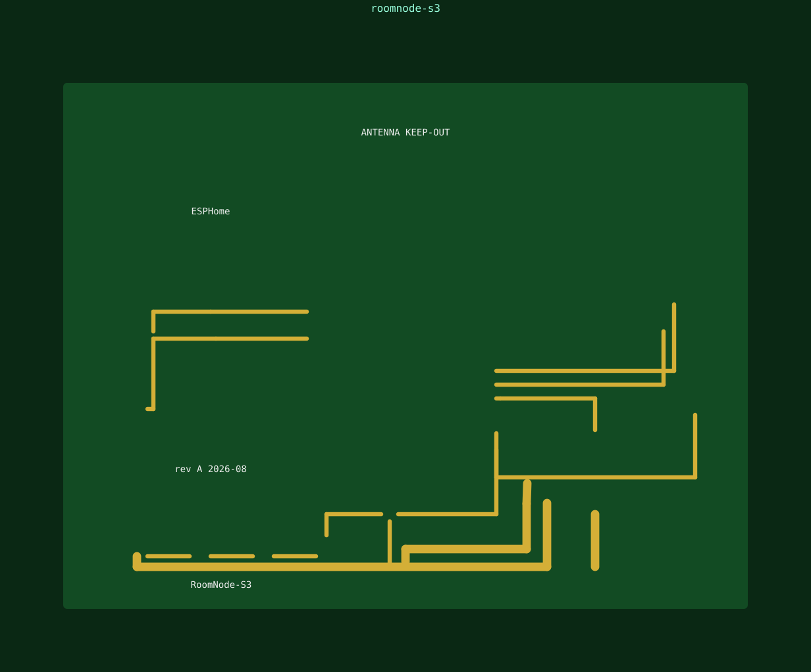
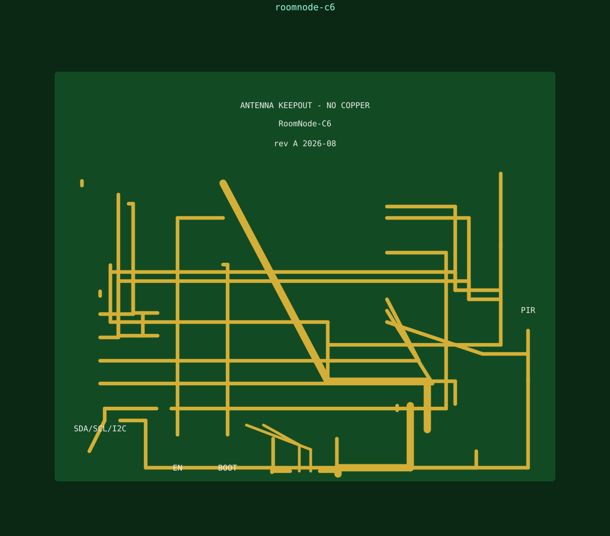
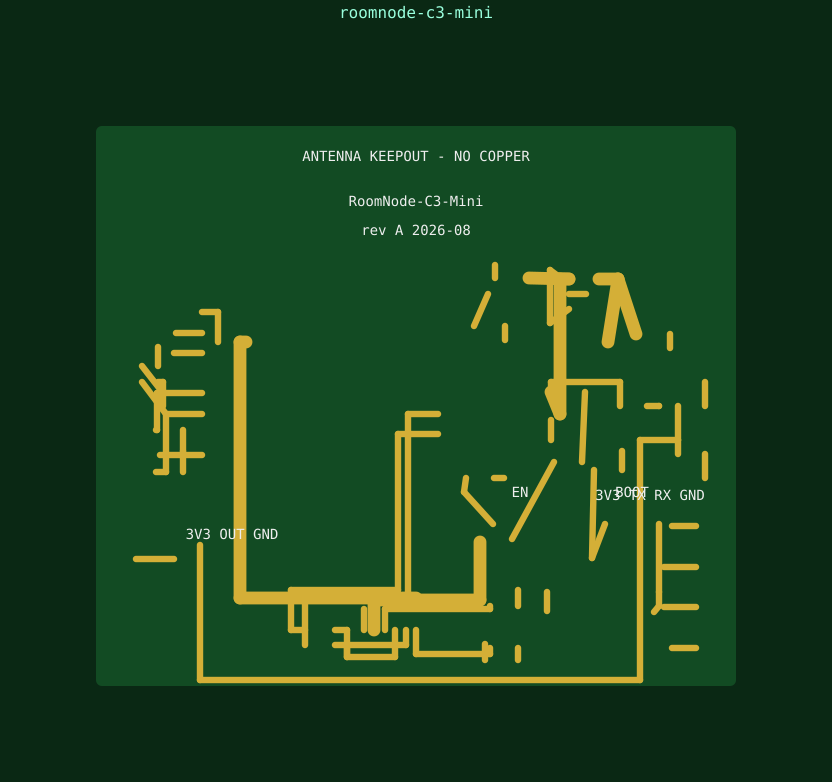
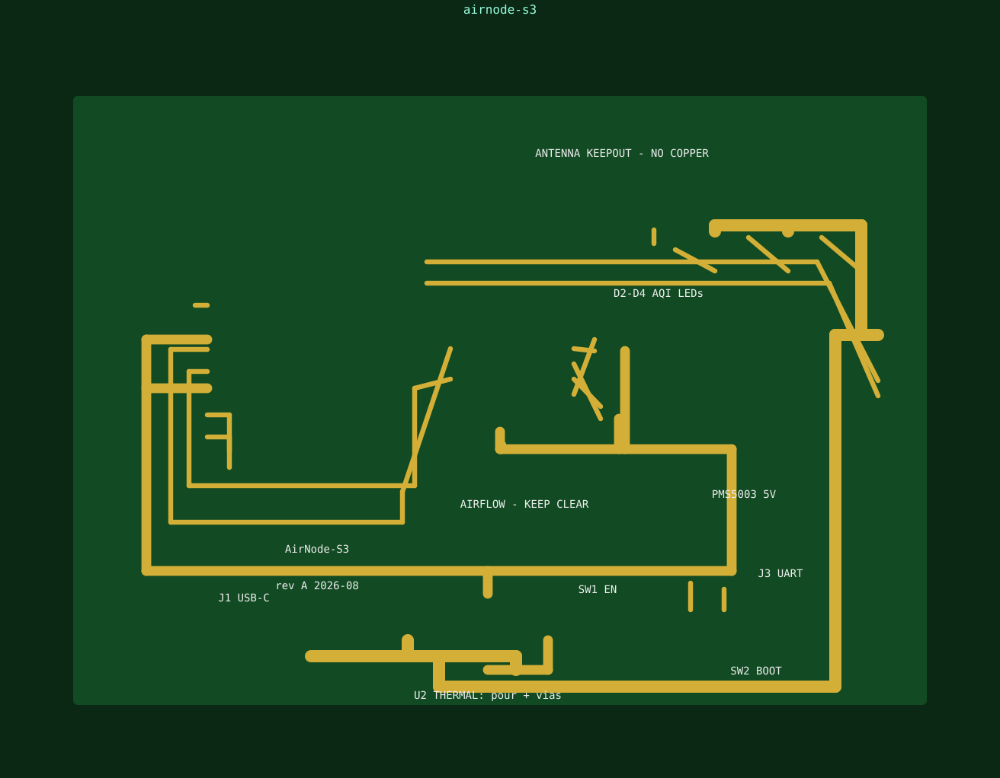

# room-node-pcbs

Multifunction **one-per-room** ESP32 sensor nodes — KiCad 8 hardware + ESPHome firmware, designed for JLCPCB 2-layer SMD assembly.

Every node combines the room-sensing essentials so a single board per room covers automation needs: human presence (mmWave and/or PIR), BLE device tracking, temperature/humidity, air quality (VOC / CO2 / particulates), light level, and addressable RGB LEDs for status/night-light.

## The boards

| Board | MCU | Radios | Sensors | LEDs | Size |
|---|---|---|---|---|---|
| **RoomNode-S3** | ESP32-S3-WROOM-1-N8R2 | WiFi + BLE5 | SHT40, SGP40 VOC, BH1750 lux, LD2450 mmWave, AM312 PIR | 4× SK6812MINI-E | 65×50 mm |
| **RoomNode-C6** | ESP32-C6-WROOM-1-N8 | WiFi6 + BLE5.3 + 802.15.4 (Thread/Zigbee) | SHT31, BME280, BH1750, AM312 PIR | 2× WS2812B-V5 | 55×45 mm |
| **RoomNode-C3-Mini** | ESP32-C3-MINI-1-N4 | WiFi + BLE5 | SHT40, ALS-PT19 light, AM312 PIR | 1× SK6812MINI-E | 40×35 mm |
| **AirNode-S3** | ESP32-S3-WROOM-1-N8R2 | WiFi + BLE5 | SCD41 CO2, SGP40 VOC, SHT40, PMS5003 PM | 3× SK6812MINI-E | 70×50 mm |

## Repo layout

```
boards/<name>/     KiCad 8 project (.kicad_pro/.kicad_sch/.kicad_pcb) + build.py generator + README/BOM
firmware/          ESPHome YAML per board
docs/              component manifest + datasheets/
models/            official Espressif STEP 3D models + Sensirion SCD4x STEP
renders/           SVG (in git) + PNG/3D board renders (generated)
tools/             kicad_gen.py (KiCad 8 generator + PNG renderer), render3d.py (isometric 3D), render_svg.py
```

## Renders

| Board | Top view |
|---|---|
| RoomNode-S3 |  |
| RoomNode-C6 |  |
| RoomNode-C3-Mini |  |
| AirNode-S3 |  |

Binary assets (datasheet PDFs, STEP 3D models, PNG renders) are not stored in git —
run `bash tools/fetch-assets.sh` to download them into `docs/datasheets/` and `models/`,
and `python3 boards/<name>/build.py` + `tools/render3d.py`/`render_svg.py` to regenerate renders.
Indexes: `docs/datasheets/README.md`, `models/README.md`.

## Design notes

- **Antenna keepout** on every module board per Espressif hardware design guidelines: antenna overhangs the board edge, >=15 mm clearance, no copper/vias/components on any layer beneath the antenna.
- **USB-C**: TYPE-C-31-M-12 with 5.1 kOhm CC1/CC2 pull-downs (required for C-to-C cables) + USBLC6-2SC6 ESD protection.
- **3.3 V rails** sized for WiFi TX bursts (500 mA ME6211 on sensor nodes, AMS1117 on AirNode for SCD41 heater + PMS5003 fan).
- All I2C sensors coexist on one bus: SHT40 0x44, SGP40 0x59, SCD41 0x62, BH1750 0x23, BME280 0x76 — pull-ups 4.7 kOhm to 3V3.
- mmWave (LD2450) and PMS5003 are 5 V-powered with 3.3 V logic UART — connect directly to ESP32 UART pins.

Files are generated programmatically (`python3 boards/<name>/build.py`) and are standard KiCad 8 format — open them in KiCad 8/9 to continue routing or run DRC.

Generated with the help of [kicad-happy](https://github.com/aklofas/kicad-happy) design-review checklists.
